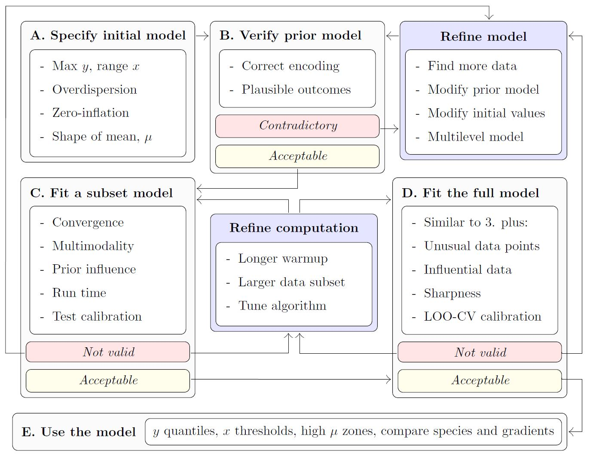

```{r setup, include = FALSE}
knitr::opts_chunk$set(
  # collapse = TRUE,
  # comment = "#>",
  message = FALSE, 
  warning = FALSE, 
  # eval = identical(Sys.getenv("NOT_CRAN"), "true"),
  dev = "png",
  dpi = 120,
  fig.asp = 0.4,
  fig.width = 10,
  out.width = "100%",
  fig.align = "center"
)
options(crayon.enabled = TRUE)
options(pillar.bold = TRUE, pillar.subtle_num = TRUE)
```

## Overview

This vignette presents a minimal Bayesian workflow for modelling the distribution of discrete **species abundance**, $y$, along an **environmental gradient**, $x$, using the **modskurt** function to predict mean abundance, $\mu$. The diagram below outlines key steps for an informative and trustworthy analysis using the `modskurt` package, and also provides a layout for the rest of this vignette. If at any stage you find yourself needing more information, please check out the references and other resources on this web page.

```{r workflow-img, echo=FALSE, out.height="100%"}
# 
htmltools::tags$img(src = 'workflow.JPG')
```

## Load packages and stan files

This section assumes you've already got `modskurt` installed and running, if not, jump over to this packages' [home page](./index.html).

```{r load-compile}
# compile_stanmodels only runs when needed, so it doesn't hurt to keep these
# lines together in any analysis
library(modskurt)
compile_stanmodels()

# everyone loves a good graph
library(ggplot2)
library(patchwork)
theme_set(theme_classic())

# for reproducibility
set.seed(123456)
```

## Case study - Tuangi vs. mud

To illustrate the `modskurt` workflow, we'll analyse the distribution of tuangi (*Austrovenus stutchburyi*, the New Zealand cockle - [more info](https://niwa.co.nz/te-kuwaha/tuangi)) counts along a gradient of estuarine sediment mud concentrations (from 0% no muddy sediment to 100% completely mud dominated - [more info](https://www.lawa.org.nz/learn/factsheets/estuaries/mud-content-in-estuaries/)). Key variables are:

- `count` the number of individual tuangi recorded in a 250g composite sediment core.
- `mud_pct` the percentage of sediment particles in the core that are less than 0.063mm in diameter

```{r data}
data(tuangi)
tuangi
```

For attribution and technical details of how these data are collected, please contact [Salt Ecology](https://www.saltecology.co.nz/contact).

## A. Specify initial model

The first step in the analysis of a species' abundance over an environmental gradient is to specify the distribution model. In general for discrete abundance data like these, we recommend first trying a **negative binomial** (NB) regression, however there may be some cases, particularly for rare and hard to sample species, where it might be worth going straight for a **zero-inflated negative binomial linked** (ZINBL) extension -- see [TODO........](for an example).

Given the negative binomial distribution of abundance, $y$, the `modskurt` package specifies that the mean of the negative binomial distribution (or expected abundance $\mu = \text{E}[y]$) is a non-linear function, $f$ of the environmental gradient, $x$, mud content in this case. Yielding the following generalised non-linear regression model (GNLM):

$$
y_n \sim \text{NegativeBinomial}\left[\mu_n = f(x_n), \kappa\right]
$$

where subscript, $n$, denotes the $n$th sample of abundance and environmental gradient, and $kappa$ is an overdispersion parameter that models the variation of abundance relative to mean abundance.

The modskurt function, $f$, is visually unappealing, but (believe us!) it produces appealing and realistic shapes of mean abundance along environmental gradients:

$$
f(x_n) =
  H \bigg[r \exp\left(\frac{1}{p}\left[\frac{x_n-m}{sr} - d\right]\right) + 
  (1 - r) \exp\left(\frac{1}{p}\left[d - \frac{x_n-m}{s\left(1 - r\right)}\right]\right) - \exp\left(-\frac{d}{p}\right) + 1\bigg] ^ {-p},
$$

with parameters:

- $H \in \mathbb{R}_{>0}$: the strictly positive maximum height of the curve; the peak in mean abundance along the environmental gradient.
- $m \in \mathbb{R}$: the environmental location of peak mean abundance.
- $s \in \mathbb{R}_{>0}$: scales the width of the curve, describing how abundance decreases away from $m$. 
- $r \in (0, 1)$: accounts for asymmetry, with $r=0.5$ indicating equal abundance in environmental conditions either side of $m$, $r$ below $0.5$ indicating more abundance below $m$, and $r$ above $0.5$ indicating more abundance above $m$.
- $d \in \mathbb{R}$: controls the peakedness ($d < 0$) or broadness ($d > 0$, e.g. plateau-like shape) of the peak in mean abundance around $m$.
- $p > 0$: persists higher-levels of abundance in relatively extreme conditions; this is a similar effect to increasing the tail weight of a distribution function.

The effect of each parameter is best described visually, so please check out this [Observable]() if you haven't already and toggle through different parameter values. Not all of these parameters are necessary for every analysis, but that discussion is best illustrated in a [separate example]().

Being a Bayesian model, we get to determine what values of each parameter are realistic given the relationship we wish to model, rather than whatever potentially unrealistic value fits the data best. This is a huge benefit of Bayesian modelling, but also a huge hurdle when dealing with complex parameter spaces like that of the model above. To make life easier, the `modskurt` package suggests some default priors that *should* just work 🤞:

$$
\begin{align}
  H &\sim \text{Beta}(2, 3) \cdot \max y \\
  m &\sim \text{Beta}(1, 1) \cdot \text{range}~ x + \min x \\
  \log s &\sim \text{Normal}(-2, 0.6) + \log \text{range}~ x \\
  r &\sim \text{Beta}(1.2, 1.2) \\
  \log d &\sim \text{Normal}(0.5, 1) \\
  p &\sim \text{Beta}(2, 4) \cdot 1.95 + 0.05, \\
\end{align}
$$

However, we still need to check these in each and every model and will be provide guidance on how to do this in section B. See ... for technical details.

Now finally, to specify this model in `R`, we use the [`mskt_spec`](../reference/mskt_spec.html) function:

```{r model}
spec <-
  mskt_spec(data = tuangi,
            # response and gradients (optional names for tidier outputs)
            y = c('Tuangi (count)' = 'count'),
            x = c('Mud (%)' = 'mud_pct'),
            # distribution of abundance
            dist = 'nb',
            # additional mean shape parameters to model, Hms are always required
            shape = 'rdp',
            # make predictions for every 1% of mud content
            pred_grid = 0:100,
            # check prior and initial fit on a subset of data
            subset_prop = 0.3)
```

The last argument, `subset_prop = 0.3`, defines the proportion of data that will be used for the subset "fail fast" model in section C later on.

We can print the model spec and defaults for interest, `hp_` refers to the hyperparameter values that define the priors above.

```{r model-spec}
str(spec)
```

## B. Verify initial model specification

This step helps in a few key ways

1. Provide greater transparency on the model assumptions and greater understanding of the model mechanics,
2. Verify that the model **only** predicts results that make sense to the best of our ecological knowledge, i.e. we give no weight to illogical parameter values, and thus estimate better measures of uncertainty.
3. Verify that the model predicts **all** results that might make sense, i.e. the prior distributions are not overly constraining the parameter space and biasing results/uncertainty away from potentially realistic outcomes.

The `modskurt` provides four checking functions:

- [`check_prior_dens`](../reference/check_prior_dens.html): Plot the marginal prior densities and check their probabilities align with reasonable values.
- [`check_prior_mskt`](../reference/check_prior_mskt.html): Randomly sample from the joint prior and check that predictions for the mean, $\mu$, contain all possible shapes and sizes.
- [`check_prior_dist`](../reference/check_prior_dist.html): Simulate $y$ replicates from the joint prior model and plot "severe tests" to check for overdispersion misspecification.
- [`check_prior_zero`](../reference/check_prior_zero.html): Predict rates of zero-inflation given the mean and check for believable relationships -- more on this [here - TODO: ZINBL vig]()

### Prior probabilities of parameter values

If you tweaked the default hyperparameters above, then you'll want to check they produce the correct marginal prior here:

```{r check-prior-dens, fig.asp=0.8, fig.cap="TODO: add legend for median, 50%HDI and 99% line!"}
check_prior_dens(spec)
```

### Prior predictions for the `modskurt` mean

The default looks like a pile of spaghetti, if you have information on any of the mean shapes you might expect, then check they are reasonably covered here and that impossible shapes are excluded, or at leasted weighted very heavily away from:

```{r check-prior-mskt, fig.cap="TODO: add legend for alpha!"}
check_prior_mskt(spec)
```

### Prior predictions for summary statistics of `y`

Severe tests for the specified distribution of $y$, idea is to check that the combination of mean shapes and overdisperion parameter, kappa, for

- Maximum observable counts: too much dispersion can produce counts that might be unrealistic or even impossible given the sampling design.
- Proportions of zeros: too much dispersion can also inflate the proportion of zeros beyond what might be credible, and cause underestimation of mean counts.
- Variation of abundance: too little dispersion (the Poisson effect) can restrict the model into overestimating mean counts in order to try and capture zero proportions or higher counts.

```{r check-prior-dist, fig.asp=0.3}
check_prior_dist(spec)
```

TODO: change these to remove the observed line? Or change the text to use more eco terms.

Looks maybe overshooting overdispersion slightly? E.g. quite high zero proportions for these data and very small inter-quartile ranges. Lets tweak the rate hyperparameter for the exponentially distribution overdispersion parameter, $\kappa \sim \text{Exp}[\lambda = \text{hp_kap}]$.

```{r, fig.asp=0.6}
spec$hp_kap <- 1
check_prior_dens(spec, 'kap') + 
  check_prior_dist(spec) +
  plot_layout(design = 'A##
              BBB')
```

A little better, and a little is fine, remember the prior model should fit knowledge of the tuangi-mud relationship, not specific data realisations of it.

*OPTIONAL*: refine model spec further

## C. Fit subset model

The prior model looks okay, so let's look at a posterior. The idea of the subset model is to "fail fast". That is, if we missed any model misspecifications above, then instead of wasting your time and computer resources fitting a full model right off the bat, we can first fit a very quick approximate model that uses a subset of the data and minimal posterior samples over maximal chains. Each chain will roughly estimate the posterior for the subset of data, and ....

```{r fit-subset, results='hide'}
fit_subset <-
  mskt_fit(spec,
           # use the subset only
           use_subset = TRUE,
           iter_warmup = 200,
           iter_sampling = 100,
           chains = 6,
           parallel_chains = 6,
           # for testing
           show_messages = TRUE, show_exceptions = TRUE)
```

Check computation.

```{r fit-subset-check}
check_computation(fit_subset)
```

*OPTIONAL*: refine model spec or fit parameters

### Check subset model

Computation valid, check posterior.

```{r check-post-dens-subset, fig.asp=0.8}
# visual display of chain mixing and prior-data conflicts
check_post_dens(fit_subset, by_chain = TRUE)
```

```{r check-post-calibration-subset}
# uses test set for discrete pit
check_post_calibration(fit_subset)
```

*OPTIONAL*: refine model spec or fit parameters

## D. Fit full model

Time for comprehensive inference, using the full dataset and a large number of posterior samples.

```{r fit-full, results='hide'}
fit_full <-
  mskt_fit(spec,
           chains = 4,
           parallel_chains = 4,
           # for testing
           show_messages = TRUE, show_exceptions = TRUE)
```

Check again, slightly better.

```{r fit-full-check}
check_computation(fit_full)
```

*OPTIONAL*: refine model spec or fit parameters

### Check full model

Given the subset model appeared to be adequately specified, and the computation diagnostics of the full model improved, we shouldn't need to do too many more checks here. To be thorough it wouldn't hurt to run through [`check_post_dens`](../reference/check_post_dens.html), [`check_post_dist`](../reference/check_post_dist.html), [`check_post_zero`](../reference/check_post_zero.html), [`check_post_calibration`](../reference/check_post_calibration.html), but for this getting started vignette we will just show one additional check.

Now that our posterior is estimated over the entire data set, we want to make sure that the subset of data used earlier was a reasonable representation of our full dataset. A useful check for this is to consider the influence each data point has on the posterior. This is somewhat similar to checking a linear regression residual plot, are there data points that the model couldn't predict very well, and is it because those data points are really unusual, or because our model is misspecified and the subset model checks didn't pick it up.

```{r check-post-influencers-full}
check_post_influencers(fit_full)
```

The model only struggled to predict one point, and the console printout shows that there was nothing unusual about that point (count = 2, mud % = 31.8) so it is safe to ignore. Later plots suggest that maybe around 30-34% mud content the data is not as dispersed as the rest, and would likely clear up as more data is collected.

*OPTIONAL*: refine model spec or fit parameters.

## E. Use the model

Now we can look at some predictions of specific interest:

- What does the distribution of tuangi over mud concentrations look like, and
- What ranges of mud concentrations correlate with higher abundances of tuangi.

### Plot summaries of the abundance distribution

This is the complete distribution, choose any summaries that are the most informative.

```{r use-full-fit-dist}
# plot the distribution of abundance along the gradient
abundance_dist(fit_full, summaries = c('mean', 'median', 'q90'))
```

### Calculate ranges of x for different percentages of abundance measures

Going back to our original question, what ranges of mud concentrations are tuangi most abundant in? There's two useful ways to look at this, we could:

1. Calculate a range of mud concentrations that correspond to the highest levels of predicted tuangi abundance (high-abundance-zone, HAZ), or
2. Determine a limit of mud concentration beyond which less than a certain level of predicted total tuangi abundance resides (abundance-density-limit, ADL).

Loosely speaking we could interpret these ranges as,

1. HAZ: mud concentrations that are more optimal for tuangi (or correspond to other optimal environmental conditions)
2. ADL: a line in the sand (or mud) where we expect to find a proportion of the total population being sampled.

Other important arguments are `capture_pct` and `based_on`, where we decide what percent of abundance (high zone or density) the range will capture, and which distribution summary the range and percent are based on. For example

- `based_on = 'mean'` use the predicted modskurt mean abundance.
- `based_on = 'q90'` use the 0.9 probability quantile of predicted abundance.

The choice of summary and capture percentages will depend on the question being answered. For these data we might start by looking at the range of mud concentrations where we expect to find 50% of the highest average tuangi counts, so `capture_pct = 50`% `using_range = 'HAZ'` `based_on = 'mean'` tuangi counts (the left hand red plot). And the upper limit of mud concentrations beyond which there is less than `capture_pct = 10`% of predicted tuangi density (`using_range = 'ADL'`) `based_on = 'mean'` predicted counts.

```{r use-full-fit-range-plot}
# compose in row using patchwork
(abundance_range(fit_full,
                 capture_pct = 50,
                 using_range = 'HAZ',
                 based_on = 'mean',
                 plotted = TRUE,
                 range_colour = 'red') +
   labs(subtitle = '50% of highest mean counts')) + 
  (abundance_range(fit_full,
                   capture_pct = 90,
                   using_range = 'ADL',
                   based_on = 'mean',
                   # specify left or right side limit
                   region = 'left',
                   plotted = TRUE,
                   range_colour = 'blue') +
     labs(y = NULL, subtitle = '90% limit of mean count density')) +
  plot_layout(guides = 'collect')
```

The console printout shows that sediment with between about 0% and 46% mud content has average tuangi counts within half (50%) of their peak average counts.

Compare those numbers with the abundance density limit that suggest 90% of predicted total mean tuangi abundance is found in sediment with less than 60.7% mud content.

## Summary

This case study lightly stepped through the core steps in the `modskurt` analysis of species abundance over environmental gradients. There are many more checks that can be performed throughout, and a whole raft of troubleshooting exercises for when your data doesn't play as nicely as these tuangi abundances did.

- List of more articles
- And resources
